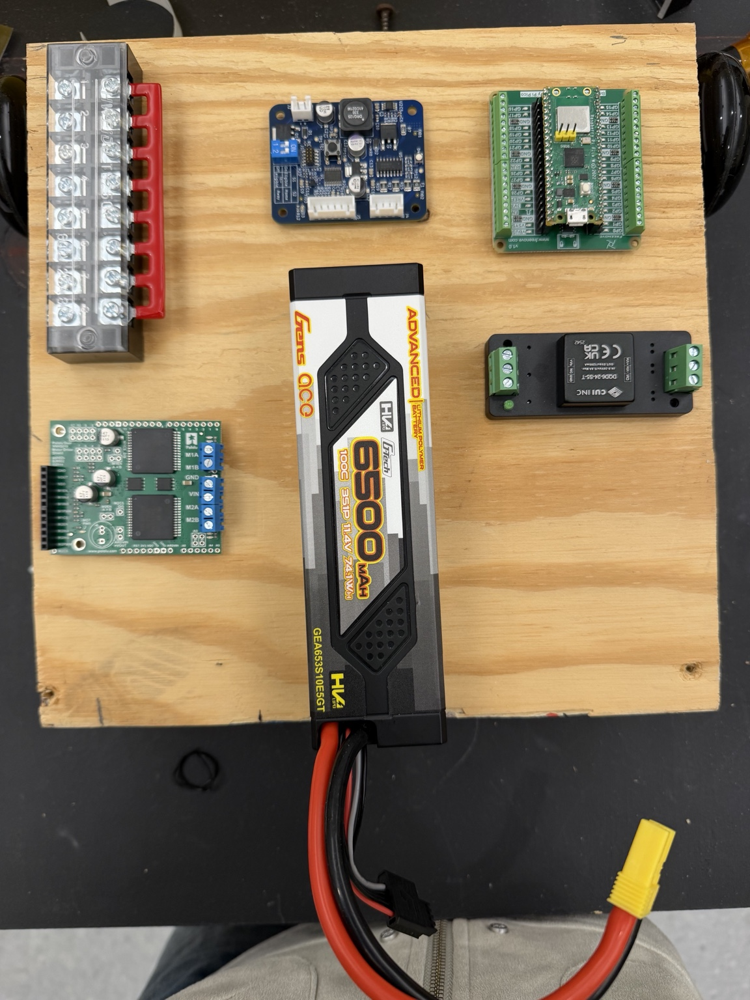
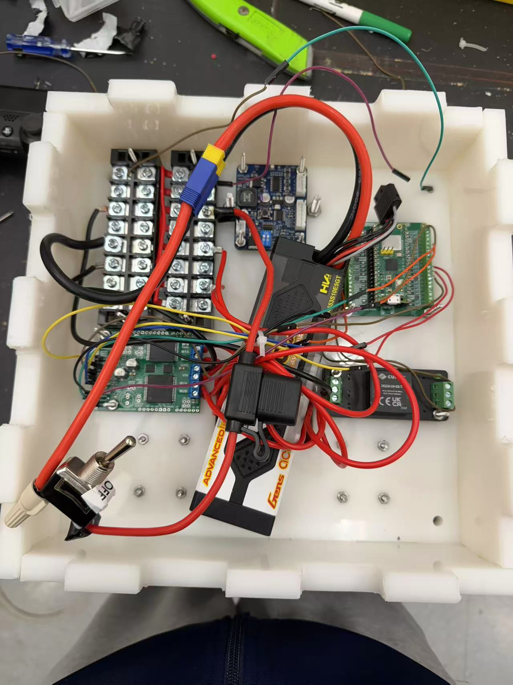

# CRFC Football Robot Development Notes

Personal build and debugging records by **Yiheng Ji** for a University of Evansville Collegiate Robotic Football Conference (CRFC) team robot, with faculty guidance from **Professors Yishu Bai and John MacDonald**.

This repository covers the early **Raspberry Pi Pico W** platform: firmware setup, assembly, driving tests and command-timeout modifications. The later course implementation is in [EE454 ESP32 Robot Final Project](https://github.com/YihengJi/EE454-ESP32-Robot-Final-Project).

## My contributions

- Configured WSL/Ubuntu, built existing starter firmware using CMake and ARM GCC, and flashed the Pico W.
- Made a temporary wooden base, assembled and wired the drive platform, and tested forward, reverse and turning behavior.
- Investigated reverse drift, intermittent wiring, power-related connection problems and mechanical fit during chassis transfer.
- Added and compiled a report-age timeout check intended to stop commanded motion when controller reports were absent for more than 300 ms, alongside existing disconnection handling.
- Maintained dated observations, photographs, code-change notes and development plans.

This was a team engineering project built on starter firmware. These records describe my contributions, not sole authorship of the complete robot or firmware.

## Development milestones

| Period | Documented work |
| --- | --- |
| March 26, 2026 | Toolchain setup, dependency troubleshooting and successful firmware build. |
| March 27 | Firmware flashing and temporary wooden-base assembly. |
| March 28 | Driving tests, motor/wheel changes, reverse drift and a loss-of-control incident. |
| March 29 | Report-timing and motion-timeout code changes documented. |
| April 2 | Power/wiring checks; original incident not reproduced; full timeout testing incomplete. |
| April 3-5 | Plastic-chassis transfer, mechanical rework and wiring diagnosis. |
| Later in Spring 2026 | ESP32 and three-sensor extension for EE-454; see the separate repository. |

## Results and limitations

The robot was assembled and driven, and the modified Pico W firmware compiled. Follow-up wire-disconnection tests using the original firmware stopped motion instead of reproducing the continued-turning event. The original cause remained unresolved and those tests did not fully exercise the new timeout mechanism.

Early entries call the event a controller "disconnect." This was an initial interpretation of observed loss of control, not a confirmed diagnosis. A clarification is included in the [build log](build_log.md), while the original entries remain intact.

## Documentation

- [Build log](build_log.md): dated work, observations, hypotheses and photographs.
- [Code update notes](code_update_notes.md): Pico W report-timing and timeout modifications.
- [Project status and next steps](project_plan.md): completed work and unresolved questions.
- [ESP32 code and limitations](https://github.com/YihengJi/EE454-ESP32-Robot-Final-Project): subsequent course implementation.

### Temporary test platform

### Chassis transfer

## Scope

This is a development-notes repository, not a complete Pico W firmware distribution. Original starter source, build configuration and dependencies are not included, so these notes alone cannot reproduce a firmware build. No fault-injection harness, quantitative reliability study or speed-adaptive braking implementation is included.

The later vision/AI quarterback senior design is separate. As of September 2026, my vision/AI component is in planning and implementation has not begun. No results from that project are claimed here.

Overview updated September 2026; original dated entries are retained.
