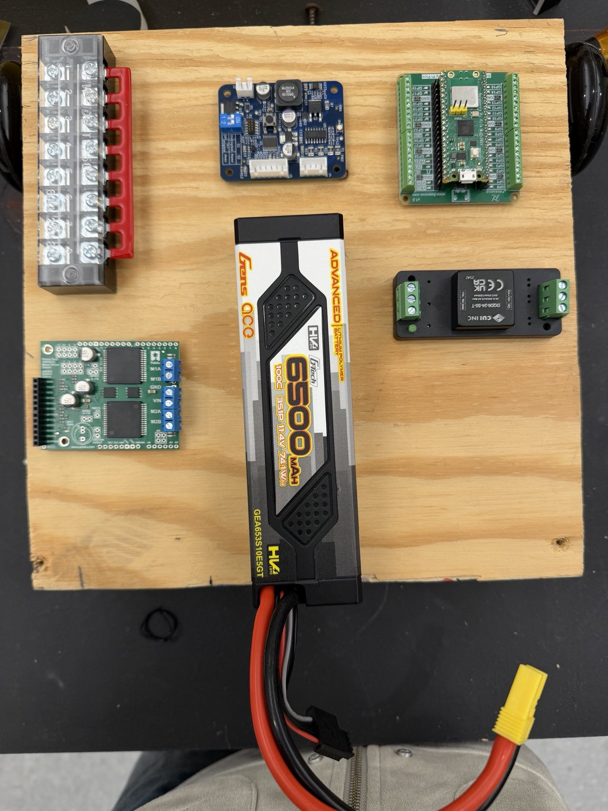

# Build Log

## Date
2026-03-26

## Environment setup
- Installed WSL and Ubuntu on Windows
- Created a Linux user account
- Installed required packages for the firmware build environment

Main packages used:
- git
- cmake
- gcc-arm-none-eabi
- libnewlib-arm-none-eabi
- build-essential

## Repository setup
- Cloned `starter-robot-firmware`
- Ran `git submodule update --init --recursive` to pull the required submodules

## Issues and fixes

### 1. Package download timeout
A large ARM-related package timed out during installation.

**Fix**  
I retried the installation and focused on the main required packages first.

### 2. Missing C++ compiler
During the CMake build, the system reported that no C++ compiler could be found.

**Fix**  
I installed `build-essential`, which provided `g++` and allowed the build process to continue.

## Build output
The firmware was built in the `build` directory.

Generated files:
- `main_app.elf`
- `main_app.uf2`

## Status
The software side is in place for now. The next hardware step will be flashing `main_app.uf2` to a Raspberry Pi Pico W and testing the robot firmware on the board.
## 2026-03-27

### Firmware and board test
- Flashed `main_app.uf2` to the Raspberry Pi Pico W
- After flashing, the board exited BOOTSEL mode
- The onboard LED blinked at startup and turned solid after the controller connected

### Temporary hardware setup
- The plastic board for the robot base had not arrived yet
- Cut a wooden board and used it as a temporary base for testing
- Mounted several main components on the wooden base, including:
  - wheels
  - Raspberry Pi Pico W
  - motor driver
  - battery
  - other power and control parts for the early test setup
### Hardware photo
Temporary hardware setup on a wooden base for early testing while waiting for the final plastic board.

### Current status
- The Pico W has been flashed and tested on the board
- A temporary base is now in place for hardware testing
- The next step is to continue wiring, power testing, and later move the setup to the final plastic base once it arrives
