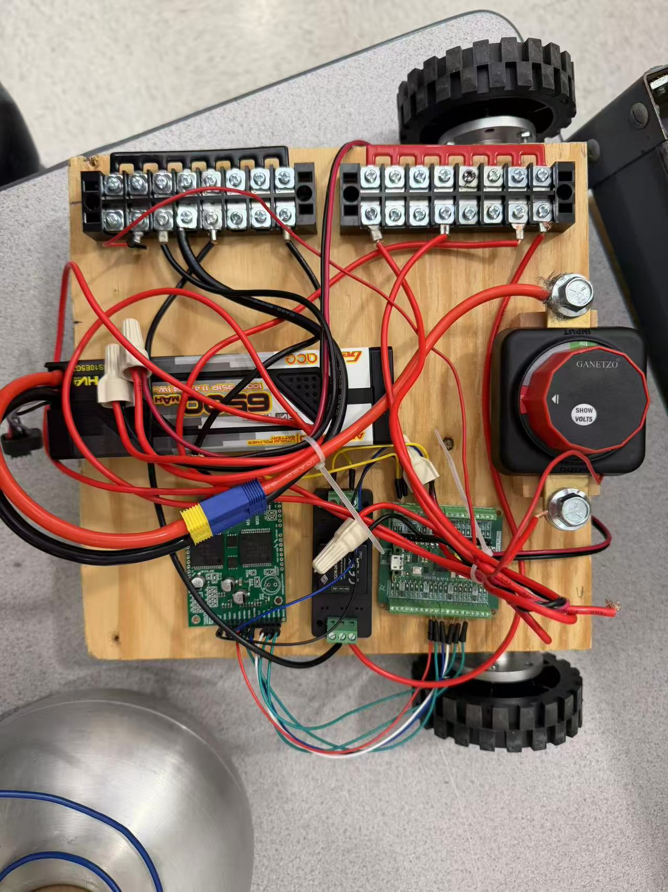

# Build Log

## Date
2026-03-26

## Environment setup
- Installed WSL and Ubuntu on Windows
- Created a Linux user account
- Installed required packages for the firmware build environment

Main packages used:
- git
- cmake
- gcc-arm-none-eabi
- libnewlib-arm-none-eabi
- build-essential

## Repository setup
- Cloned `starter-robot-firmware`
- Ran `git submodule update --init --recursive` to pull the required submodules

## Issues and fixes

### 1. Package download timeout
A large ARM-related package timed out during installation.

**Fix**  
I retried the installation and focused on the main required packages first.

### 2. Missing C++ compiler
During the CMake build, the system reported that no C++ compiler could be found.

**Fix**  
I installed `build-essential`, which provided `g++` and allowed the build process to continue.

## Build output
The firmware was built in the `build` directory.

Generated files:
- `main_app.elf`
- `main_app.uf2`

## Status
The software side is in place for now. The next hardware step will be flashing `main_app.uf2` to a Raspberry Pi Pico W and testing the robot firmware on the board.

## Date 2026-03-27

### Firmware and board test
- Flashed `main_app.uf2` to the Raspberry Pi Pico W
- After flashing, the board exited BOOTSEL mode
- The onboard LED blinked at startup and turned solid after the controller connected

### Temporary hardware setup
- The plastic board for the robot base had not arrived yet
- Cut a wooden board and used it as a temporary base for testing
- Mounted several main components on the wooden base, including:
  - wheels
  - Raspberry Pi Pico W
  - motor driver
  - battery
  - other power and control parts for the early test setup

### Hardware photo
Temporary hardware setup on a wooden base for early testing while waiting for the final plastic board.

### Current status
- The Pico W has been flashed and tested on the board
- A temporary base is now in place for hardware testing
- The next step is to continue wiring, power testing, and later move the setup to the final plastic base once it arrives

## Date 2026-03-28

### Circuit assembly and first full robot test
- Built the first full robot based on the wiring diagram for the circuit setup
- Finished the circuit wiring and mounted the main hardware components on the temporary wooden base
- Completed the first full movement test with the assembled robot

### Motor and wheel change
- During early testing, the original motors did not provide enough power and the robot moved too slowly
- Replaced the original motors with higher-power motors from the parts inventory
- Also changed the wheels during the hardware update
- After the motor and wheel change, the robot speed increased noticeably

### Movement test results
- Forward motion worked well
- Left and right turning both responded quickly
- The two motors appeared balanced during forward motion
- The robot was generally able to maintain a straight path while moving forward, although small adjustments were sometimes needed
- Turning logic was checked during testing:
  - for left turn, the left wheel moved backward and the right wheel moved forward
  - for right turn, the right wheel moved backward and the left wheel moved forward

### Reverse motion issue
- Reverse motion did not stay straight
- The two rear wheels appeared to rotate at different speeds during reverse movement
- The robot tended to drift and turn toward the left while backing up
- The exact cause has not been identified yet

### Current thoughts on the reverse issue
At this point, I think the reverse problem may come from several possible sources.

#### Motor-side possibility
- I currently suspect the motor side more strongly
- One possible reason is that the right motor may be less efficient during reverse rotation

#### Driver and power-side possibilities
- I am confident that the two motors themselves have matching specifications
- Possible causes on the driver or power side include:
  - unequal voltage drop or resistance between the left and right motor power paths
  - different contact quality at terminals, connectors, or wiring points during reverse load

#### Control-side possibilities
- The same PWM values may not produce symmetric behavior in reverse
- The code may not have separate calibration or compensation for reverse motion
- Any left-right compensation that works for forward motion may not work the same way in reverse

### Controller disconnect issue
- During a longer driving test, the robot lost control after roughly 50 meters of operation
- At the moment of disconnect, the robot had been receiving a left-turn command
- After losing the connection, it continued repeating the last left-turn action instead of stopping
- I had to lift the robot and cut power manually
- After a restart and reconnection, the system returned to normal

### Safety concern from testing
- The robot currently keeps executing the last valid command after controller disconnect
- This creates a control and safety problem, especially after the speed increase from the motor upgrade

### Test setup photo
First full robot test setup after wiring, assembly, and motor replacement.

### Notes for next revision
- Investigate why reverse output is not balanced between the two motors
- Compare reverse behavior on both sides more carefully
- Check the wiring, terminals, and power path on both motor channels
- Review whether reverse motion needs its own calibration or compensation in code
- Add a protection function so that the motors stop if no new command is received within a short time
- Consider additional safety logic for controller disconnect cases before pushing for higher speed
